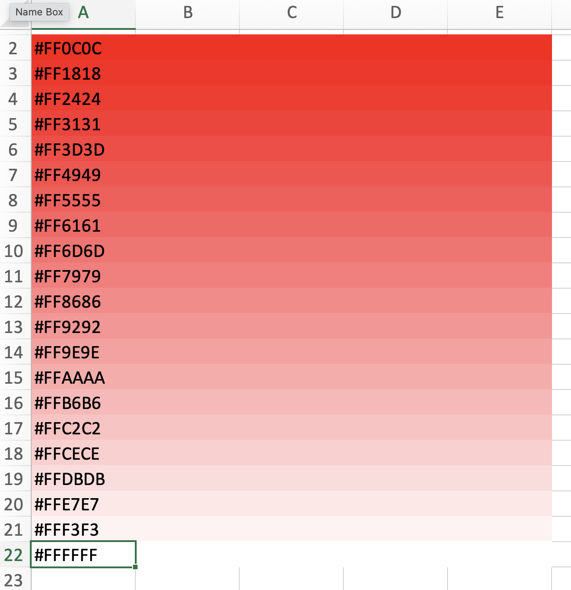

# ExcelSheetGradient
VBA Macro to color the rows of a cell block from one color to another

Example:

I couldn't find a decent way to color the cells in an Excel spreadsheet with a gradient from one color to another and not use the box shape (which does have a gradient fill option) so over lunch decided to write my own. 

Add `gradient.cls` to whatever workbook you want to use the macro, then call it like:
`GradientCellBlock "A2:E22", Array(255, 0, 0), Array(250, 240, 230)`

You can modify the macro to use something like `Application.Selection` if you want to base it on what is selected in the current spreadsheet. That's left as an exercise to the reader though; I needed a programatic solution.

Enjoy!
